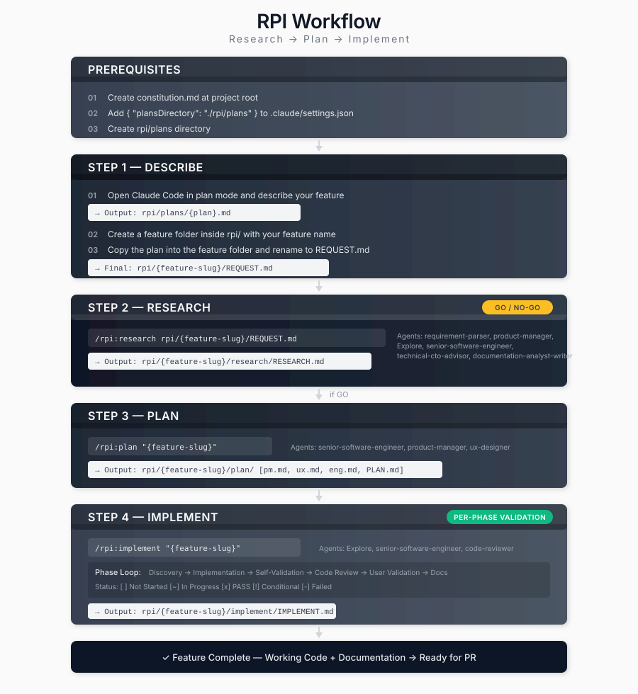

<!--
  이 문서는 development-workflows/rpi/rpi-workflow.md의 한글 번역본입니다. 원본(영문)이 source of truth이며,
  구조·배지·링크·코드·앵커는 원본과 동일하게 보존하고 산문만 번역했습니다.
  동기화 규칙: .claude/rules/korean-sync.md
-->

# RPI Workflow

**RPI** = **R**esearch → **P**lan → **I**mplement

각 단계마다 검증 게이트를 두는 체계적인 개발 워크플로우입니다. 실현 불가능한 기능에 노력을 낭비하는 것을 방지하고 포괄적인 문서화를 보장합니다.

<table width="100%">
<tr>
<td><a href="../../">← Back to Claude Code Best Practice</a></td>
<td align="right"></td>
</tr>
</table>

---

## Overview



---

## Installation

`.claude` 폴더(`agents/`와 `commands/rpi/`를 포함)를 저장소 루트에 복사한 다음, `rpi/plans` 디렉터리를 생성합니다.

---

## Example Workflow

### Feature: User Authentication

**Step 1: Describe**
```
User: "Add OAuth2 authentication with Google and GitHub providers"

1. Claude generates plan
   → Output: rpi/plans/oauth2-authentication.md
2. Create feature folder: rpi/oauth2-authentication/
3. Copy the plan into the feature folder
4. Rename the plan to REQUEST.md
   → Final: rpi/oauth2-authentication/REQUEST.md
```

**Step 2: Research**
```bash
/rpi:research rpi/oauth2-authentication/REQUEST.md
```
출력:
- 분석 내용을 담은 `research/RESEARCH.md`
- 판정: **GO** (실현 가능하며 전략에 부합)

**Step 3: Plan**
```bash
/rpi:plan oauth2-authentication
```
출력:
- `plan/pm.md` - 사용자 스토리 및 인수 기준
- `plan/ux.md` - 로그인 UI 흐름
- `plan/eng.md` - 기술 아키텍처
- `plan/PLAN.md` - 3개 단계, 15개 작업

**Step 4: Implement**
```bash
/rpi:implement oauth2-authentication
```
진행 상황:
- Phase 1: Backend Foundation → PASS
- Phase 2: Frontend Integration → PASS
- Phase 3: Testing & Polish → PASS

결과: 기능 완성, PR 준비 완료.

---

## Feature Folder Structure

모든 기능 작업은 `rpi/{feature-slug}/` 안에서 이루어집니다:

```
rpi/{feature-slug}/
├── REQUEST.md              # Step 1: Initial feature description
├── research/
│   └── RESEARCH.md         # Step 2: GO/NO-GO analysis
├── plan/
│   ├── PLAN.md             # Step 3: Implementation roadmap
│   ├── pm.md               # Product requirements
│   ├── ux.md               # UX design
│   └── eng.md              # Technical specification
└── implement/
    └── IMPLEMENT.md        # Step 4: Implementation record
```

---

## Agents and Commands

| Command | Agents Used |
|---------|-------------|
| `/rpi:research` | requirement-parser, product-manager, Explore, senior-software-engineer, technical-cto-advisor, documentation-analyst-writer |
| `/rpi:plan` | senior-software-engineer, product-manager, ux-designer, documentation-analyst-writer |
| `/rpi:implement` | Explore, senior-software-engineer, code-reviewer |
