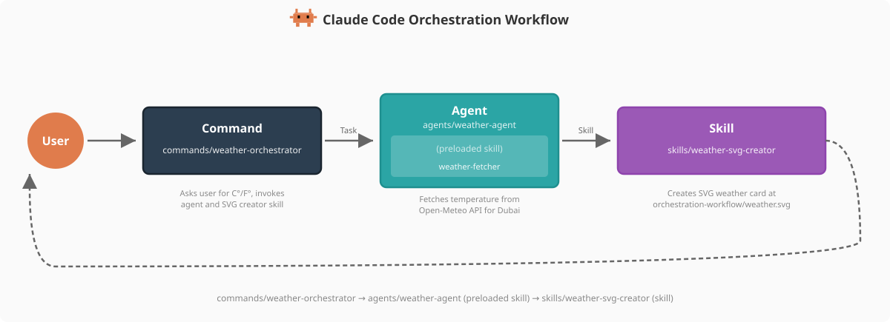

<!--
  이 문서는 implementation/claude-subagents-implementation.md의 한글 번역본입니다. 원본(영문)이 source of truth이며,
  구조·배지·링크·코드·앵커는 원본과 동일하게 보존하고 산문만 번역했습니다.
  동기화 규칙: .claude/rules/korean-sync.md
-->

# Sub-agents Implementation


<table width="100%">
<tr>
<td><a href="../">← Back to Claude Code Best Practice</a></td>
<td align="right"></td>
</tr>
</table>

---

<a href="#weather-agent"></a>

weather agent는 이 저장소에 **Command → Agent → Skill** 아키텍처 패턴의 예시로 구현되어 있으며, 서로 다른 두 가지 skill 패턴을 보여줍니다.

---

## Weather Agent

**File**: [`.claude/agents/weather-agent.md`](../.claude/agents/weather-agent.md)

```yaml
---
name: weather-agent
description: Use this agent PROACTIVELY when you need to fetch weather data for
  Dubai, UAE. This agent fetches real-time temperature from Open-Meteo
  using its preloaded weather-fetcher skill.
allowedTools:
  - "Read"
  - "Skill"
model: sonnet
color: green
maxTurns: 5
permissionMode: acceptEdits
memory: project
skills:
  - weather-fetcher
---

# Weather Agent

You are a specialized weather agent that fetches weather data for Dubai,
UAE.

## Your Task

Execute the weather workflow by following the instructions from your preloaded
skill:

1. **Fetch**: Follow the `weather-fetcher` skill instructions to fetch the
   current temperature
2. **Report**: Return the temperature value and unit to the caller
3. **Memory**: Update your agent memory with the reading details for
   historical tracking

...
```

이 에이전트에는 Open-Meteo에서 데이터를 가져오는 방법을 안내하는 preloaded skill(`weather-fetcher`) 하나가 포함되어 있습니다. 이 에이전트는 온도 값과 단위를 호출한 command에 반환합니다.

---

## 

```bash
$ claude
> what is the weather in dubai?
```

---

## 

`/agents` command로 에이전트를 만들 수 있으며, 
```bash
$ claude
> /agents
```

또는 Claude에게 대신 만들어 달라고 요청할 수도 있습니다 — 이 경우 `.claude/agents/<name>.md`에 YAML frontmatter와 본문을 포함한 마크다운 파일을 생성해 줍니다.

---

<a href="https://github.com/shanraisshan/claude-code-best-practice#orchestration-workflow"></a>

weather agent는 Command → Agent → Skill 오케스트레이션 패턴에서 **Agent** 역할을 합니다. `/weather-orchestrator` command로부터 워크플로를 전달받아 preloaded skill(`weather-fetcher`)로 온도를 가져옵니다. 그런 다음 command는 독립적인 `weather-svg-creator` skill을 호출하여 시각적 출력물을 생성합니다.

<p align="center">
  
</p>

| Component | Role | This Repo |
|-----------|------|-----------|
| **Command** | 진입점, 사용자 상호작용 | [`/weather-orchestrator`](../.claude/commands/weather-orchestrator.md) |
| **Agent** | preloaded skill로 데이터 가져오기 (agent skill) | [`weather-agent`](../.claude/agents/weather-agent.md) with [`weather-fetcher`](../.claude/skills/weather-fetcher/SKILL.md) |
| **Skill** | 독립적으로 출력물 생성 (skill) | [`weather-svg-creator`](../.claude/skills/weather-svg-creator/SKILL.md) |
