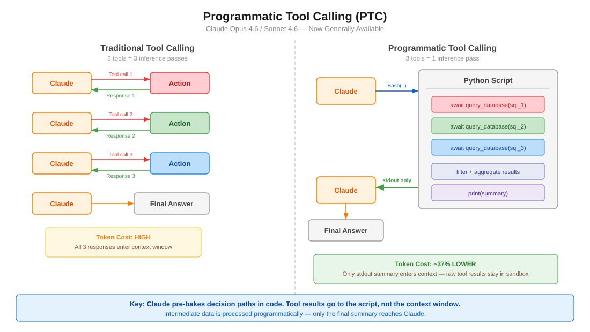

<!--
  이 문서는 reports/claude-advanced-tool-use.md의 한글 번역본입니다. 원본(영문)이 source of truth이며,
  구조·배지·링크·코드·앵커는 원본과 동일하게 보존하고 산문만 번역했습니다.
  동기화 규칙: .claude/rules/korean-sync.md
-->

# Claude Advanced Tool Use Patterns

토큰 소비와 지연 시간을 줄이고 도구 사용 정확도를 높이는 API 수준 기능들(현재 GA). Opus/Sonnet 4.6과 함께 출시되었습니다.

<table width="100%">
<tr>
<td><a href="../">← Back to Claude Code Best Practice</a></td>
<td align="right"></td>
</tr>
</table>

## Table of Contents

1. [Overview](#overview)
2. [Programmatic Tool Calling (PTC)](#programmatic-tool-calling-ptc)
3. [Dynamic Filtering for Web Search/Fetch](#dynamic-filtering-for-web-searchfetch)
4. [Tool Search Tool](#tool-search-tool)
5. [Tool Use Examples](#tool-use-examples)
6. [Claude Code Relevance](#claude-code-relevance)

---

## Overview

| Feature | Problem Solved | Token Savings | Availability |
|---------|---------------|---------------|--------------|
| Programmatic Tool Calling | 다단계 에이전트 루프가 왕복 호출로 토큰을 소모함 | 약 37% 절감 | API, Foundry (GA) |
| Dynamic Filtering | 웹 검색/페치 결과가 무관한 내용으로 컨텍스트를 부풀림 | 입력 토큰 약 24% 감소 | API, Foundry (GA) |
| Tool Search Tool | 너무 많은 도구 정의가 컨텍스트를 부풀림 | 약 85% 절감 | API, Foundry (GA) |
| Tool Use Examples | 스키마만으로는 사용 패턴을 표현할 수 없음 | 정확도 72% → 90% | API, Foundry (GA) |

모든 기능은 2026년 2월 18일부로 **일반 공급(GA)** 되었습니다.

**전략적 계층화(Strategic layering)** — 가장 큰 병목부터 시작하세요:
- 도구 정의로 인한 컨텍스트 부풀림 → Tool Search Tool
- 큰 중간 결과 → Programmatic Tool Calling
- 웹 검색 노이즈 → Dynamic Filtering
- 파라미터 오류 → Tool Use Examples

---

## Programmatic Tool Calling (PTC)



### The Paradigm Shift

**이전 (전통적 도구 호출):**
```
User prompt → Claude → Tool call 1 → Response 1 → Claude → Tool call 2 → Response 2 → Claude → Tool call 3 → Response 3 → Claude → Final answer
```
도구 호출마다 전체 모델 왕복이 필요합니다. 도구 3개 = 추론 3회.

**이후 (프로그래매틱 도구 호출):**
```
User prompt → Claude → writes Python script → Script calls Tool 1, Tool 2, Tool 3 internally → stdout → Claude → Final answer
```
Claude가 모든 도구를 오케스트레이션하는 코드를 작성합니다. 최종 `stdout`만 컨텍스트 창에 들어갑니다. 도구 3개 = 추론 1회.

### How It Works

1. `allowed_callers: ["code_execution_20250825"]`로 도구를 정의합니다
2. Claude가 샌드박스 내부에서 해당 도구들을 async 함수로 호출하는 Python을 작성합니다
3. 도구 함수가 호출되면 샌드박스가 일시 중지되고 API가 `tool_use` 블록을 반환합니다
4. 도구 결과를 제공하면, 이는 Claude의 컨텍스트가 아니라 **실행 중인 코드**로 전달됩니다
5. 코드가 재개되어 결과를 처리하고, 필요하면 도구를 더 호출합니다
6. 최종 실행의 `stdout`만 Claude에 도달합니다

### Key Configuration

```json
{
  "tools": [
    {
      "type": "code_execution_20250825",
      "name": "code_execution"
    },
    {
      "name": "query_database",
      "description": "Execute a SQL query. Returns rows as JSON objects with fields: id (str), name (str), revenue (float).",
      "input_schema": {
        "type": "object",
        "properties": {
          "sql": { "type": "string", "description": "SQL query to execute" }
        },
        "required": ["sql"]
      },
      "allowed_callers": ["code_execution_20250825"]
    }
  ]
}
```

### The `allowed_callers` Field

| Value | Behavior |
|-------|----------|
| `["direct"]` | 전통적 도구 호출만 가능 (생략 시 기본값) |
| `["code_execution_20250825"]` | Python 샌드박스에서만 호출 가능 |
| `["direct", "code_execution_20250825"]` | 두 모드 모두 사용 가능 |

**권장 사항:** 도구마다 두 모드를 다 두지 말고 하나만 선택하세요. 그래야 Claude에게 더 명확한 지침이 됩니다.

### The `caller` Field in Responses

모든 도구 사용 블록에는 어떻게 호출되었는지 알 수 있도록 `caller` 필드가 포함됩니다:

```json
// Direct (traditional)
{ "caller": { "type": "direct" } }

// Programmatic (from code execution)
{ "caller": { "type": "code_execution_20250825", "tool_id": "srvtoolu_abc123" } }
```

### Advanced Patterns

**배치 처리(Batch processing)** — 추론 1회로 N개 항목 처리:
```python
regions = ["West", "East", "Central", "North", "South"]
results = {}
for region in regions:
    data = await query_database(f"SELECT SUM(revenue) FROM sales WHERE region='{region}'")
    results[region] = data[0]["revenue"]

top = max(results.items(), key=lambda x: x[1])
print(f"Top region: {top[0]} with ${top[1]:,}")
```

**조기 종료(Early termination)** — 성공 기준이 충족되는 즉시 중단:
```python
endpoints = ["us-east", "eu-west", "apac"]
for endpoint in endpoints:
    status = await check_health(endpoint)
    if status == "healthy":
        print(f"Found healthy endpoint: {endpoint}")
        break
```

**조건부 도구 선택(Conditional tool selection):**
```python
file_info = await get_file_info(path)
if file_info["size"] < 10000:
    content = await read_full_file(path)
else:
    content = await read_file_summary(path)
print(content)
```

**데이터 필터링(Data filtering)** — Claude가 보는 내용을 줄이기:
```python
logs = await fetch_logs(server_id)
errors = [log for log in logs if "ERROR" in log]
print(f"Found {len(errors)} errors")
for error in errors[-10:]:
    print(error)
```

### Model Compatibility

| Model | Supported |
|-------|-----------|
| Claude Opus 4.6 | Yes |
| Claude Sonnet 4.6 | Yes |
| Claude Sonnet 4.5 | Yes |
| Claude Opus 4.5 | Yes |

### Constraints

| Constraint | Detail |
|-----------|--------|
| **Bedrock/Vertex 미지원** | API와 Foundry에서만 사용 가능 |
| **MCP 도구 불가** | MCP 커넥터 도구는 프로그래매틱하게 호출할 수 없음 |
| **웹 검색/페치 불가** | 웹 도구는 PTC에서 지원되지 않음 |
| **구조화 출력 불가** | `strict: true` 도구는 호환되지 않음 |
| **강제 도구 선택 불가** | `tool_choice`로 PTC를 강제할 수 없음 |
| **컨테이너 수명** | 만료까지 약 4.5분 |
| **ZDR** | Zero Data Retention 적용 대상 아님 |
| **도구 결과는 문자열** | 코드 인젝션 위험을 대비해 외부 결과를 검증할 것 |

### When to Use PTC

| Good Use Cases | Less Ideal |
|----------------|------------|
| 집계가 필요한 대용량 데이터셋 처리 | 단순 응답의 단일 도구 호출 |
| 순차적으로 의존하는 3개 이상의 도구 호출 | 즉각적인 사용자 피드백이 필요한 도구 |
| Claude가 보기 전에 결과를 필터링/변환 | 매우 빠른 작업 (오버헤드 > 이점) |
| 다수 항목에 대한 병렬 작업 | |
| 중간 결과에 기반한 조건부 로직 | |

### Token Efficiency

- 프로그래매틱 호출의 도구 결과는 **Claude의 컨텍스트에 추가되지 않고** 최종 `stdout`만 추가됩니다
- 중간 처리는 모델 토큰이 아니라 코드에서 일어납니다
- 프로그래매틱하게 도구 10개 ≈ 직접 호출 10회 대비 약 1/10 토큰

---

## Dynamic Filtering for Web Search/Fetch

### The Problem

웹 검색·페치 도구는 전체 HTML 페이지를 Claude의 컨텍스트 창에 그대로 쏟아붓습니다. 그 내용 대부분은 내비게이션, 광고, 상용구 등 무관한 것입니다. Claude는 그 전부를 대상으로 추론하면서 토큰을 낭비하고 정확도를 떨어뜨립니다.

### The Solution

이제 Claude는 웹 결과가 컨텍스트 창에 들어오기 전에 **Python 코드를 작성·실행해 결과를 필터링**합니다. 원시 HTML을 대상으로 추론하는 대신, 샌드박스에서 관련 내용만 필터링·파싱·추출합니다.

### How It Works

**이전:**
```
Query → Search results → Fetch full HTML × N pages → All content enters context → Claude reasons over everything
```

**이후:**
```
Query → Search results → Claude writes filtering code → Code extracts relevant content only → Filtered results enter context
```

### API Configuration

베타 헤더와 함께 갱신된 도구 타입 버전을 사용합니다:

```json
{
  "model": "claude-opus-4-6",
  "max_tokens": 4096,
  "tools": [
    {
      "type": "web_search_20260209",
      "name": "web_search"
    },
    {
      "type": "web_fetch_20260209",
      "name": "web_fetch"
    }
  ]
}
```

**필요한 헤더:** `anthropic-beta: code-execution-web-tools-2026-02-09`

Sonnet 4.6 및 Opus 4.6에서 새로운 도구 타입 버전을 사용하면 **기본적으로 활성화**됩니다.

### Benchmark Results

**BrowseComp** (웹사이트에서 특정 정보 찾기):

| Model | Without Filtering | With Filtering | Improvement |
|-------|-------------------|----------------|-------------|
| Sonnet 4.6 | 33.3% | **46.6%** | +13.3 pp |
| Opus 4.6 | 45.3% | **61.6%** | +16.3 pp |

**DeepsearchQA** (다단계 리서치, F1 점수):

| Model | Without Filtering | With Filtering | Improvement |
|-------|-------------------|----------------|-------------|
| Sonnet 4.6 | 52.6% | **59.4%** | +6.8 pp |
| Opus 4.6 | 69.8% | **77.3%** | +7.5 pp |

**토큰 효율:** 입력 토큰 평균 24% 감소. Sonnet 4.6은 비용이 줄어드는 반면, Opus 4.6은 더 복잡한 필터링 코드로 인해 소폭 증가할 수 있습니다.

### Use Cases

- 기술 문서 훑어보기
- 여러 출처에 걸친 인용 검증
- 검색 결과 교차 참조
- 다단계 리서치 쿼리
- 대용량 페이지에 묻힌 특정 데이터 포인트 찾기

---

## Tool Search Tool

### The Problem

모든 도구 정의를 앞부분에 미리 로드하면 컨텍스트가 낭비됩니다. MCP 도구 50개가 각각 약 1.5K 토큰이라면, 사용자가 질문하기도 전에 75K 토큰을 씁니다.

### The Solution

자주 쓰지 않는 도구에 `defer_loading: true`를 표시하세요. 이 도구들은 초기 컨텍스트에서 제외됩니다. Claude는 Tool Search Tool을 통해 필요할 때 이 도구들을 발견합니다.

### Configuration

```json
{
  "tools": [
    {
      "type": "mcp_toolset",
      "mcp_server_name": "google-drive",
      "default_config": { "defer_loading": true },
      "configs": {
        "search_files": { "defer_loading": false }
      }
    }
  ]
}
```

### Best Practices

- 가장 많이 쓰는 도구 3~5개는 항상 로드하고 나머지는 지연 로딩할 것
- 명확하고 설명적인 도구 이름과 설명을 작성할 것 (검색이 이에 의존함)
- 시스템 프롬프트에 사용 가능한 기능을 문서화할 것

### When to Use

- 도구 정의가 10K 토큰을 초과할 때
- 사용 가능한 도구가 10개 이상일 때
- 여러 MCP 서버를 쓸 때
- 선택지가 너무 많아 도구 선택 정확도에 문제가 생길 때

### Token Savings

도구 정의 토큰 약 85% 감소 (Anthropic 벤치마크에서 77K → 8.7K).

### Claude Code Equivalent

Claude Code에는 **MCP tool search auto mode**가 있습니다(v2.1.7부터 기본 활성화). MCP 도구 설명이 컨텍스트의 10%를 초과하면 지연 로드되어 `MCPSearch`를 통해 발견됩니다. `ENABLE_TOOL_SEARCH=auto:N`으로 임계값을 설정하며, 여기서 N은 컨텍스트 비율(0-100)입니다.

---

## Tool Use Examples

### The Problem

JSON 스키마는 구조를 정의하지만 다음은 표현할 수 없습니다:
- 선택적 파라미터를 언제 포함할지
- 어떤 파라미터 조합이 타당한지
- 형식 규칙 (날짜 형식, ID 패턴)
- 중첩 구조 사용법

### The Solution

도구 정의에 `input_examples`를 추가하세요 — 스키마를 넘어서는 구체적인 사용 패턴입니다.

### Configuration

```json
{
  "name": "create_ticket",
  "description": "Create a support ticket",
  "input_schema": {
    "type": "object",
    "properties": {
      "title": { "type": "string" },
      "priority": { "type": "string", "enum": ["low", "medium", "high", "critical"] },
      "assignee": { "type": "string" },
      "labels": { "type": "array", "items": { "type": "string" } }
    },
    "required": ["title"]
  },
  "input_examples": [
    {
      "title": "Login page returns 500 error",
      "priority": "critical",
      "assignee": "oncall-team",
      "labels": ["bug", "auth", "production"]
    },
    {
      "title": "Add dark mode support",
      "priority": "low",
      "labels": ["feature-request", "ui"]
    },
    {
      "title": "Update API docs for v2 endpoints"
    }
  ]
}
```

### Best Practices

- "example_value" 같은 자리표시자 문자열이 아니라 **현실적인 데이터**를 사용할 것
- **다양성**을 보여줄 것: 최소, 부분, 전체 지정 예시
- 간결하게 유지할 것: **도구당 1~5개 예시**
- 모호성 해소에 집중할 것 — 스키마 완전성보다 동작의 명확성을 목표로
- 파라미터 상관관계를 보여줄 것 (예: `priority: "critical"`은 대체로 `assignee`를 동반)

### Results

Anthropic 벤치마크에서 복잡한 파라미터 처리 정확도 72% → 90%.

---

## Claude Code Relevance

### What applies directly to Claude Code users

| Feature | Claude Code Status | Action |
|---------|-------------------|--------|
| Tool Search | v2.1.7부터 MCPSearch auto mode로 내장 | MCP 도구가 많다면 `ENABLE_TOOL_SEARCH=auto:N` 조정 |
| Dynamic Filtering | CLI에서는 미제공 (API 수준 웹 도구) | 웹 리서치를 하는 Agent SDK 사용자에게 관련 |
| PTC | CLI에서는 미제공 | 커스텀 에이전트를 만드는 Agent SDK 사용자에게 관련 |
| Tool Use Examples | CLI에서 설정 불가 | 커스텀 MCP 서버 작성자에게 관련 |

### For Agent SDK developers

`@anthropic-ai/claude-agent-sdk`로 에이전트를 구축한다면 PTC를 바로 적용할 수 있습니다:

1. 도구 배열에 `code_execution_20250825` 추가
2. 배치/필터링으로 이득을 보는 도구에 `allowed_callers` 설정
3. 도구 결과 루프 구현 (일시 중지 → 결과 제공 → 재개)
4. 프로그래매틱 파싱을 쉽게 하도록 도구에서 구조화된 데이터(JSON) 반환

### For MCP server authors

커스텀 MCP 서버를 구축한다면 Tool Use Examples로 Claude가 도구를 쓰는 방식을 개선할 수 있습니다:
- 도구 스키마에 `input_examples` 추가
- 설명에 반환 형식을 명확히 문서화 (PTC가 이를 파싱해야 함)

---

## Sources

- [Anthropic Engineering: Advanced Tool Use](https://www.anthropic.com/engineering/advanced-tool-use)
- [Programmatic Tool Calling Documentation](https://platform.claude.com/docs/en/agents-and-tools/tool-use/programmatic-tool-calling)
- [Code Execution Tool Documentation](https://platform.claude.com/docs/en/agents-and-tools/tool-use/code-execution-tool)
- [Improved Web Search with Dynamic Filtering](https://claude.com/blog/improved-web-search-with-dynamic-filtering)
