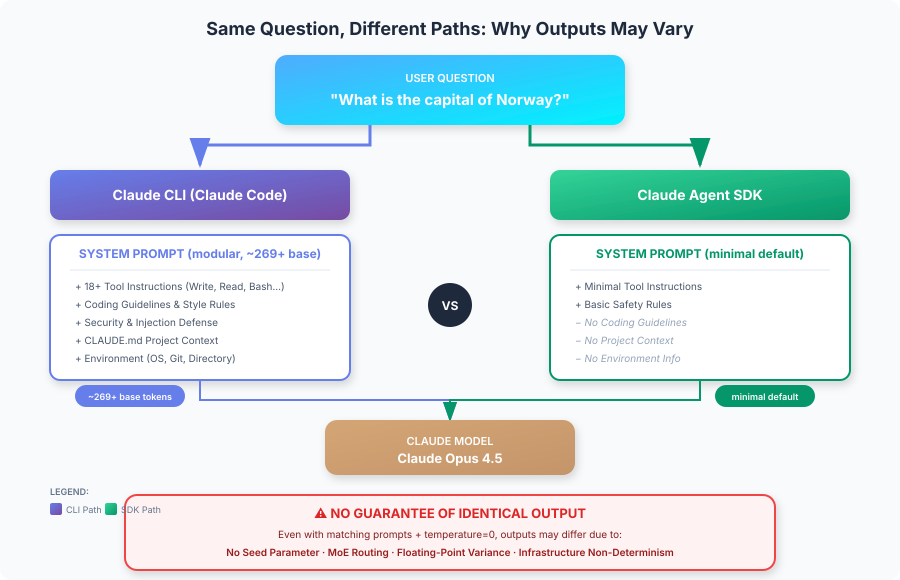

<!--
  이 문서는 reports/claude-agent-sdk-vs-cli-system-prompts.md의 한글 번역본입니다. 원본(영문)이 source of truth이며,
  구조·배지·링크·코드·앵커는 원본과 동일하게 보존하고 산문만 번역했습니다.
  동기화 규칙: .claude/rules/korean-sync.md
-->

# Claude Agent SDK vs Claude CLI: System Prompts and Output Consistency

<table width="100%">
<tr>
<td><a href="../">← Back to Claude Code Best Practice</a></td>
<td align="right"></td>
</tr>
</table>



---

## Executive Summary

동일한 메시지(예: "What is the capital of Norway?")를 **Claude Agent SDK**와 **Claude CLI (Claude Code)** 각각을 통해 보낼 때, 이 메시지에 동반되는 시스템 프롬프트는 근본적으로 다릅니다. CLI는 **모듈형 시스템 프롬프트 아키텍처**(기본 약 269 토큰에, 기능에 따라 추가 컨텍스트가 조건부로 로드됨)를 사용하는 반면, SDK는 기본적으로 최소한의 프롬프트를 사용합니다. 시드 파라미터가 없고 Claude 아키텍처 자체에 비결정성이 내재되어 있기 때문에, 설정을 일치시키더라도 **두 방식 간에 동일한 출력이 보장되지는 않습니다**.

---

## 1. System Prompt Comparison

### Claude CLI (Claude Code)

Claude CLI는 약 269 토큰의 기본 프롬프트에 추가 컨텍스트가 조건부로 로드되는 **모듈형 시스템 프롬프트 아키텍처**를 사용합니다:

| Component | Description | Loading |
|-----------|-------------|---------|
| **Base System Prompt** | 핵심 지침 및 동작 | 항상 (약 269 토큰) |
| **Tool Instructions** | 18개 이상의 내장 도구(Write, Read, Edit, Bash, TodoWrite 등) | 항상 |
| **Coding Guidelines** | 코드 스타일, 포매팅 규칙, 보안 관행 | 항상 |
| **Safety Rules** | 거부 규칙, 인젝션 방어, 유해성 방지 | 항상 |
| **Response Style** | 어조, 장황함, 설명 깊이, 이모지 사용 | 항상 |
| **Environment Context** | 작업 디렉터리, git 상태, 플랫폼 정보 | 항상 |
| **Project Context** | CLAUDE.md 내용, 설정, 훅 구성 | 조건부 |
| **Subagent Prompts** | Plan 모드, Explore 에이전트, Task 에이전트 | 조건부 |
| **Security Review** | 확장된 보안 지침(약 2,610 토큰) | 조건부 |

**Key Characteristics:**
- 110개 이상의 시스템 프롬프트 문자열이 조건부로 로드되는 **모듈형 아키텍처**
- 기본 프롬프트는 크지 않으며(약 269 토큰), 전체 크기는 활성화된 기능에 따라 달라짐
- 광범위한 보안 및 인젝션 방어 계층 포함
- 작업 디렉터리의 CLAUDE.md 파일을 자동으로 로드
- 인터랙티브 모드에서 세션 전반에 걸쳐 유지되는 컨텍스트

### Claude Agent SDK

Agent SDK는 기본적으로 다음을 포함하는 **최소한의 시스템 프롬프트**를 사용합니다:

| Component | Description | Token Impact |
|-----------|-------------|--------------|
| **Essential Tool Instructions** | 명시적으로 제공된 도구만 | 최소 |
| **Basic Safety** | 최소한의 안전 지침 | 최소 |

**Key Characteristics:**
- 기본적으로 코딩 가이드라인이나 스타일 선호도가 없음
- 명시적으로 구성하지 않는 한 프로젝트 컨텍스트가 없음
- 광범위한 도구 설명이 없음
- CLI 동작을 재현하려면 명시적 구성이 필요함

---

## 2. What Each Interface Sends

### Example: "What is the capital of Norway?"

#### Via Claude CLI

```
System Prompt: [modular, ~269+ base tokens]
├── Base system prompt (~269 tokens)
├── Tool instructions (Write, Read, Edit, Bash, Grep, Glob, etc.)
├── Git safety protocols
├── Code reference guidelines
├── Professional objectivity instructions
├── Security and injection defense rules
├── Environment context (OS, directory, date)
├── CLAUDE.md content (if present) [conditional]
├── MCP tool descriptions (if configured) [conditional]
├── Plan/Explore mode prompts [conditional]
└── Session/conversation context

User Message: "What is the capital of Norway?"
```

#### Via Claude Agent SDK (Default)

```
System Prompt: [minimal]
├── Essential tool instructions (if any tools provided)
└── Basic operational context

User Message: "What is the capital of Norway?"
```

#### Via Agent SDK (with `claude_code` preset)

```typescript
const response = await query({
  prompt: "What is the capital of Norway?",
  options: {
    systemPrompt: {
      type: "preset",
      preset: "claude_code"
    }
  }
});
```

```
System Prompt: [modular, matches CLI]
├── Full Claude Code system prompt
├── Tool instructions
├── Coding guidelines
└── Safety rules

// NOTE: Still does NOT include CLAUDE.md unless settingSources is configured
```

---

## 3. Customization Methods

### Claude CLI Customization

| Method | Command | Effect |
|--------|---------|--------|
| **Append to prompt** | `claude -p "..." --append-system-prompt "..."` | 기본값을 유지하면서 지침을 추가 |
| **Replace prompt** | `claude -p "..." --system-prompt "..."` | 시스템 프롬프트를 완전히 대체 |
| **Project context** | CLAUDE.md file | 자동으로 로드되며 지속됨 |
| **Output styles** | `/output-style [name]` | 사전 정의된 응답 스타일 적용 |

### Agent SDK Customization

| Method | Configuration | Effect |
|--------|---------------|--------|
| **Custom prompt** | `systemPrompt: "..."` | 기본값을 완전히 대체(도구를 잃음) |
| **Preset with append** | `systemPrompt: { type: "preset", preset: "claude_code", append: "..." }` | CLI 기능 + 커스텀 지침을 함께 유지 |
| **CLAUDE.md loading** | `settingSources: ["project"]` | 프로젝트 수준 지침을 로드 |
| **Output styles** | `settingSources: ["user"]` or `settingSources: ["project"]` | 저장된 출력 스타일을 로드 |

### Configuration Comparison Table

| Feature | CLI Default | SDK Default | SDK with Preset |
|---------|-------------|-------------|-----------------|
| Tool instructions | ✅ Full | ❌ Minimal | ✅ Full |
| Coding guidelines | ✅ Yes | ❌ No | ✅ Yes |
| Safety rules | ✅ Yes | ❌ Basic | ✅ Yes |
| CLAUDE.md auto-load | ✅ Yes | ❌ No | ❌ No* |
| Project context | ✅ Automatic | ❌ No | ❌ No* |

*명시적인 `settingSources: ["project"]` 구성이 필요함

---

## 4. Output Consistency Guarantees

### Critical Finding: NO Determinism Guaranteed

**Claude Messages API는 재현성을 위한 시드 파라미터를 제공하지 않습니다.** 이는 근본적인 아키텍처 한계입니다.

### Factors Preventing Identical Output

| Factor | Description | Controllable? |
|--------|-------------|---------------|
| **Different system prompts** | CLI와 SDK의 기본값이 다름 | ✅ 예(구성으로) |
| **Floating-point arithmetic** | 병렬 하드웨어의 특성 | ❌ 아니오 |
| **MoE routing** | Mixture-of-Experts 아키텍처의 변동성 | ❌ 아니오 |
| **Batching/scheduling** | 클라우드 인프라 차이 | ❌ 아니오 |
| **Numeric precision** | 추론 엔진 간 차이 | ❌ 아니오 |
| **Model snapshots** | 버전 업데이트/변경 | ❌ 아니오 |

### Temperature and Sampling

`temperature=0.0`(그리디 디코딩)에서도:
- 완전한 결정성이 **보장되지 않습니다**
- 인프라 요인으로 인해 사소한 변동이 여전히 발생할 수 있음
- 알려진 버그: [Claude CLI produces non-deterministic output for identical inputs](https://github.com/anthropics/claude-code/issues/3370)

---

## 5. Achieving Maximum Consistency

SDK와 CLI 간에 **가능한 한 가장 가까운** 동일 출력을 얻으려면:

### Agent SDK Configuration

```typescript
import Anthropic from "@anthropic-ai/sdk";

const client = new Anthropic();

// Option 1: Use claude_code preset
const response = await client.messages.create({
  model: "claude-sonnet-4-20250514",
  max_tokens: 1024,
  // Match CLI system prompt as closely as possible
  system: "Your exact system prompt matching CLI",
  messages: [
    { role: "user", content: "What is the capital of Norway?" }
  ],
  // Use greedy decoding for maximum consistency
  temperature: 0
});

// Option 2: With Agent SDK query function
import { query } from "@anthropic-ai/agent-sdk";

for await (const message of query({
  prompt: "What is the capital of Norway?",
  options: {
    systemPrompt: {
      type: "preset",
      preset: "claude_code"
    },
    temperature: 0,
    model: "claude-sonnet-4-20250514",
    // Load project context like CLI does
    settingSources: ["project"]
  }
})) {
  // Process response
}
```

### CLI Configuration

```bash
# Match the SDK configuration as closely as possible
claude -p "What is the capital of Norway?" \
  --model claude-sonnet-4-20250514 \
  --temperature 0
```

### Still Not Guaranteed

완벽하게 일치하는 구성을 사용하더라도:
- 실행할 때마다 출력이 다를 수 있음
- SDK와 CLI 간에 출력이 다를 수 있음
- 재현성을 강제할 수 있는 시드 파라미터가 존재하지 않음

---

## 6. Practical Implications

### When to Use Each Interface

| Use Case | Recommended Interface | Reason |
|----------|----------------------|--------|
| 인터랙티브 개발 | Claude CLI | 전체 도구 모음, 프로젝트 컨텍스트 |
| 프로그래밍 방식 통합 | Agent SDK | 세밀한 제어, 임베딩 |
| 일관된 API 응답 | Agent SDK + custom prompt | 시스템 프롬프트에 대한 더 많은 제어 |
| 배치 처리 | Agent SDK | 자동화 파이프라인에 더 적합 |
| 일회성 작업 | Claude CLI | 더 빠른 설정, 즉각적인 컨텍스트 |

### Design Recommendations

1. **비트 단위로 완벽한 재현성에 의존하지 말 것**
   - 사소한 출력 변동에도 견고한 애플리케이션을 구축
   - 구조화된 출력과 검증을 사용

2. **일관성이 필요한 프로덕션 파이프라인의 경우:**
   - 가능한 경우 결과를 캐싱
   - JSON 스키마 검증과 함께 구조화된 출력을 사용
   - 결정적 로직 및 검증과 결합
   - 다중 생성 후 합의(consensus) 방식을 고려

3. **SDK에서 CLI 동작을 재현하려면:**
   ```typescript
   systemPrompt: {
     type: "preset",
     preset: "claude_code",
     append: "Your additional instructions"
   },
   settingSources: ["project", "user"]
   ```

---

## 7. System Prompt Token Impact

| Configuration | Architecture | Notes |
|---------------|-------------|-------|
| SDK (minimal) | Minimal default | 필수 도구 지침만 포함 |
| SDK (claude_code preset) | Modular (~269+ base) | CLI와 일치하며, 기능에 따라 달라짐 |
| CLI (default) | Modular (~269+ base) | 추가 컨텍스트가 조건부로 로드됨 |
| CLI (with MCP tools) | Modular + MCP | MCP 도구 설명이 상당한 토큰을 추가 |

**Note:** Claude Code는 110개 이상의 시스템 프롬프트 문자열을 갖춘 모듈형 아키텍처를 사용합니다. 기본 프롬프트는 약 269 토큰이며, 개별 구성 요소는 활성화된 기능에 따라 18에서 2,610 토큰 범위입니다.

**Implication:** SDK의 최소 기본값은 실제 작업에 더 많은 컨텍스트를 제공하지만, 그 대가로 Claude Code의 전체 기능을 잃게 됩니다.

---

## 8. Summary Table

| Aspect | Claude CLI | Agent SDK (Default) | Agent SDK (Preset) |
|--------|------------|--------------------|--------------------|
| **System prompt** | Modular (~269+ base) | Minimal | Modular (matches CLI) |
| **Tools included** | 18+ builtin | Only if provided | 18+ builtin |
| **CLAUDE.md auto-load** | Yes | No | No (needs config) |
| **Coding guidelines** | Yes | No | Yes |
| **Safety rules** | Full | Basic | Full |
| **Temperature control** | Yes | Yes | Yes |
| **Determinism guarantee** | No | No | No |
| **Identical outputs?** | N/A | No (vs CLI) | Closer, but no |

---

## 9. Conclusion

**Q: SDK와 CLI에서 동일한 메시지에 어떤 시스템 프롬프트가 동반되는가?**

CLI는 약 269 토큰의 기본 프롬프트와 110개 이상의 조건부 로드 구성 요소(도구 지침, 코딩 가이드라인, 안전 규칙, 프로젝트 컨텍스트)를 갖춘 **모듈형 시스템 프롬프트 아키텍처**를 사용합니다. SDK는 필수 도구 지침만 포함하는 **최소 기본값**을 사용하지만, `claude_code` 프리셋을 사용해 CLI 동작에 맞게 구성할 수 있습니다.

**Q: 동일한 출력이 보장되는가?**

**아니오.** 시스템 프롬프트가 일치하고 입력이 동일하며 `temperature=0`이더라도, 다음과 같은 이유로 동일한 출력이 보장되지 않습니다:
- Claude API에 시드 파라미터가 없음
- 부동소수점 산술의 변동
- 인프라 수준의 비결정성
- 모델 아키텍처(Mixture-of-Experts) 라우팅의 변동

**Recommendation:** 결정적 동작에 의존하기보다 출력 변동에 견고하도록 시스템을 설계하세요. 일관성이 중요한 애플리케이션에서는 구조화된 출력, 캐싱, 검증 계층을 사용하세요.

---

## Sources

- [Modifying System Prompts - Agent SDK](https://docs.anthropic.com/en/docs/agents-and-tools/claude-code/sdk#modifying-system-prompts)
- [Claude Code CLI Reference](https://docs.anthropic.com/en/docs/agents-and-tools/claude-code/cli)
- [Claude Code Headless Mode](https://docs.anthropic.com/en/docs/agents-and-tools/claude-code/headless)
- [Claude Code Best Practices - Anthropic Engineering](https://www.anthropic.com/engineering/claude-code-best-practices)
- [Claude Messages API Reference](https://docs.anthropic.com/en/api/messages)
- [GitHub Issue #3370: Non-deterministic output](https://github.com/anthropics/claude-code/issues/3370)
- [Claude Code System Prompts Repository](https://github.com/Piebald-AI/claude-code-system-prompts) - 모듈형 프롬프트 아키텍처 분석
- [Why Deterministic Output from LLMs is Nearly Impossible](https://unstract.com/blog/understanding-why-deterministic-output-from-llms-is-nearly-impossible/)

---

*This report was generated by Claude Code using the Opus 4.5 model on February 3, 2026.*
